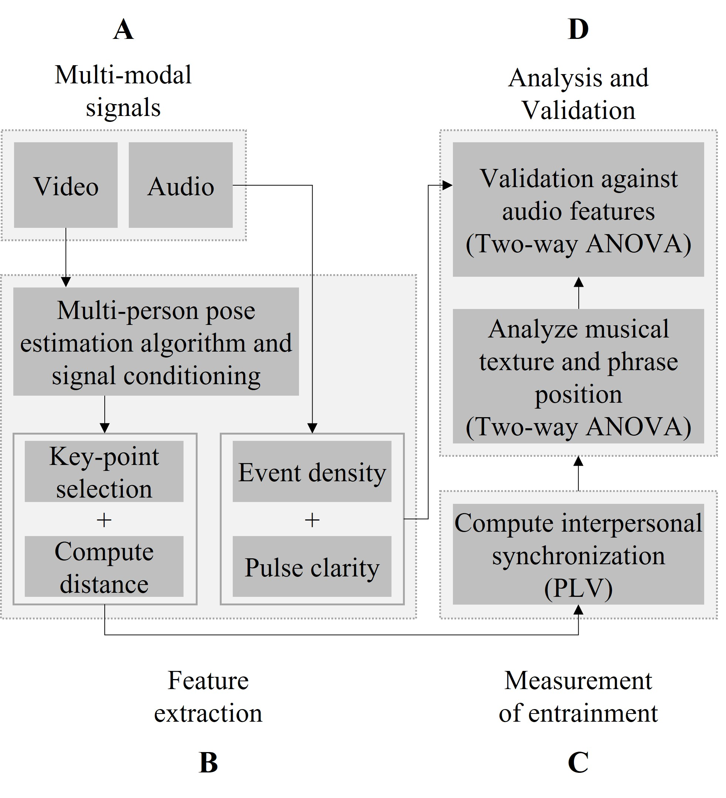

# huSync - A computational approach and system for computing dyadic synchronization in small groups

## Table of contents
* [General Information](#general-information)
* [Technology](#technology)
* [Methodlogy and Setup](#methodology-and-setup)

## General info
Use case for the paper submission in IEEE Access:
_Video sequences of a professional musical ensemble_

This repository contains the code that was developed in order to compute Dyadic Synchronization between participants in small groups.
We test our system on video sequences of co-performers in a small group of musicians. The src folder contains two files:
  1. Module_DataExtraction: This file contains the code that extracts the data for each performers by isolating them individually. It stores the output as a .csv file
  2. Module_DyadicSynchronization: This file contains the code that extracts the data from the .csv file processed by the first file (Module_DataExtraction), and provides the Dyadic Synchronization between all possible pairs in a small group, and in this case the musical ensemble.

Both the files have been shared as a jupyter notebook since this should make it easier to execute the code with more control.
The added control helps perform experiments carefully, particularly since the data from pose estimation algorithms can be noisy and sometimes requires manual intervention.
	
## Technology
Project is created with:
* Python
* IDE: Jupyter Notebook
* Libraries required: pandas, numpy, matplotlib, scipy, tslearn.metrics, scipy.signal, cmath, math, functools
	
## Methodology and Setup

Our code follows the model as described in the paper, and below is an instance.


As observed, block B (Feature extraction) requires data from a multi-person pose estimation algorithm. For our use case, we utilize [AlphaPose v0.4.0](https://github.com/MVIG-SJTU/AlphaPose). Once the .json file is available as an output, we utilize the file src/Module_DataExtraction.ipynb to create csv files of the data with trajectory information (x,y) of all participants separated in columns.

After this, we utilize the file src/Module_DyadicSynchronization.ipynb to compute the dyadic synchronization between all possible pairs.

## Analysis

We perform a statistical analysis using a two-way ANOVA measure, and utilize [Jamovi](https://www.jamovi.org/) to conduct these tests.


### Code maintained by
Sanket Rajeev Sabharwal (sabharwal@edu.unige.it)

### Note for researchers:

If this research helps you please use the following citation:
```
To be entered after acceptance
```
